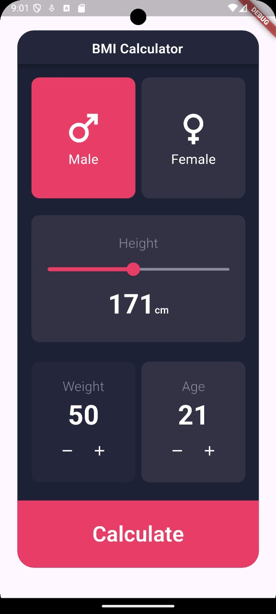

# BMI Calculator

BMI Calculator adalah aplikasi mobile berbasis Flutter yang digunakan untuk menghitung Indeks Massa Tubuh (Body Mass Index/BMI). Aplikasi ini memungkinkan pengguna untuk memasukkan data berat badan, tinggi badan, usia, dan jenis kelamin untuk mendapatkan hasil BMI beserta kategorinya.

## Fitur Utama
- Memilih jenis kelamin (Laki-laki / Perempuan)
- Mengatur tinggi badan menggunakan slider
- Menyesuaikan berat badan dan usia dengan tombol increment/decrement
- Menghitung BMI berdasarkan data yang dimasukkan
- Menampilkan hasil BMI beserta kategori kesehatan (Underweight, Normal, Overweight, Obese)
- Tombol untuk menghitung ulang BMI

## Teknologi yang Digunakan
- **Flutter**: Framework untuk pengembangan aplikasi mobile
- **Dart**: Bahasa pemrograman utama
- **Provider / State Management** (opsional)

## Cara Menjalankan Aplikasi
1. Pastikan Flutter telah terinstal di sistem Anda.
2. Clone repositori proyek ini:
   ```sh
   git clone https://github.com/your-repo/bmi_calculator_flutter.git
   ```
3. Masuk ke direktori proyek:
   ```sh
   cd bmi_calculator_flutter
   ```
4. Jalankan perintah berikut untuk menginstal dependensi:
   ```sh
   flutter pub get
   ```
5. Jalankan aplikasi di emulator atau perangkat fisik:
   ```sh
   flutter run
   ```

## Screenshot Aplikasi
### Tampilan Input Data


### Tampilan Hasil BMI


## Perhitungan BMI
Rumus perhitungan BMI yang digunakan:
```
BMI = berat badan (kg) / (tinggi badan (m) * tinggi badan (m))
```
Kategori BMI:
- **BMI < 18.5** : Underweight
- **18.5 - 24.9** : Normal
- **25 - 29.9** : Overweight
- **>= 30** : Obese
